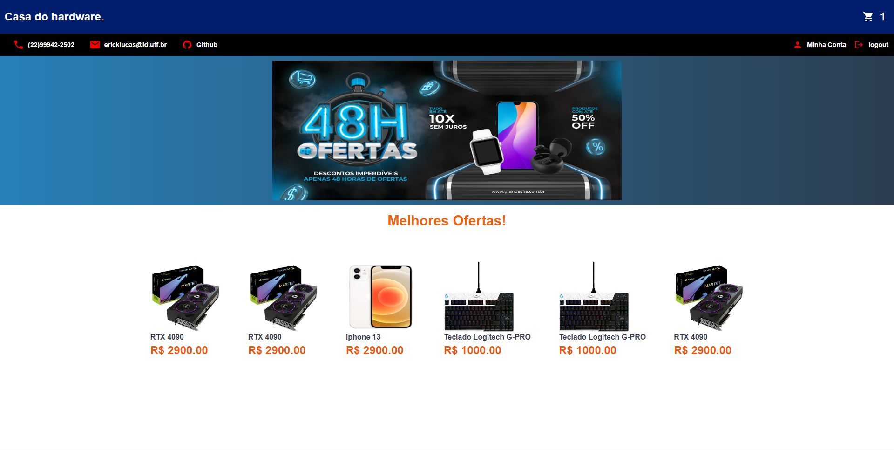
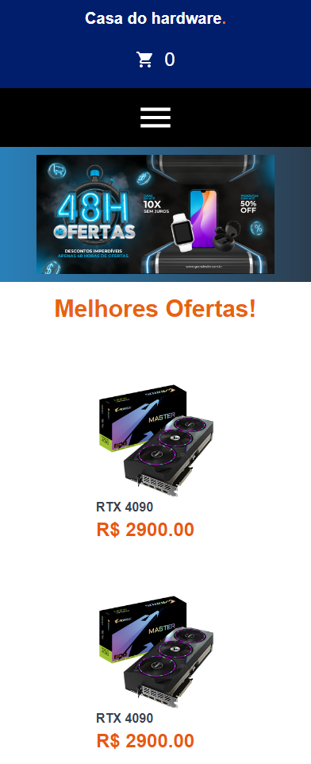

## Demo 📸




## Sobre o Projeto

Casa do hardware, e-commerce do eletrônicos.

Em Breve, novas funcionalidades.

[Para testar](https://casa-do-hardware.vercel.app/)

### 🛠 Tecnologias

As seguintes ferramentas foram usadas na construção do projeto:


### 🖥️​ Front-end

- [React](https://reactjs.org/)
- [React-Router](https://reactrouter.com/en/main)
- [TypeScript](https://www.typescriptlang.org/)
- [ContextAPI](https://reactjs.org/docs/context.html)
- [axios](https://axios-http.com/docs/intro)
- [Sass](https://sass-lang.com/)
- [Tailwind](https://tailwindcss.com/)
- [StyledComponents](https://styled-components.com/)
- [MaterialUI](https://mui.com/material-ui/getting-started/overview/)

### ⚙️ BACK-End

- [NodeJs](https://nodejs.org/en/)
- [Express.js](https://expressjs.com/)
- [MongoDB](https://www.mongodb.com/docs/)
- [Mongoose](https://mongoosejs.com/docs/guide.html)

---
## Instalação

Clone o projeto

```bash
  git clone https://github.com/ErickElc/E-Commerce
```

Entre no diretório do projeto

```bash
  cd e-commerce
```

Instale as dependências

```bash
  npm install
```
## Rodando localmente

Inicie o servidor

```bash
  npm start
```

---

<a href="https://www.linkedin.com/in/erick-nascimento-1926a8231/">
</a>
<br />


Veja meu Linkedin: [Erick Nascimento](https://www.linkedin.com/in/erick-nascimento-1926a8231/)